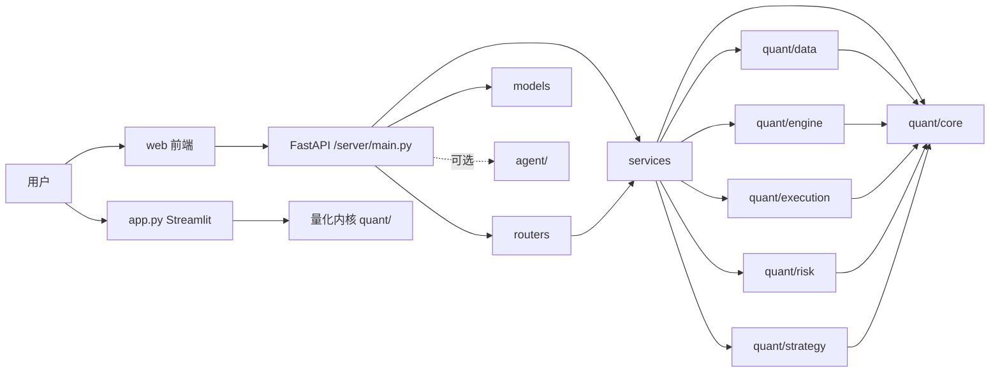

# quant 项目架构说明

本文档整理 `quant` 项目的整体架构、各代码块职责，以及从前端到后端再到量化引擎的主要执行流程。

## 1. 项目定位

这个项目本质上是一个「量化研究 + 回测 + 实盘执行 + 选股 + AI Agent」的综合平台，核心由三层组成：

1. `quant/` 是量化引擎内核，负责数据、策略、风控、订单、持仓和执行。
2. `server/` 是 FastAPI 后端，负责把引擎能力包装成 HTTP API 和 WebSocket 服务。
3. `web/` 是 React + Vite 的前端控制台，用于回测、选股、行情查看和 Agent 对话。

另外还有一个 `app.py`，它是一个独立的 Streamlit 回测可视化入口，适合本地快速验证策略。

## 统一配置

项目运行配置统一放在 `config/quant.env`。该文件包含数据源 Token、AI
模型、端口、并发、内存限制和 Futu OpenD 等设置，并已被
Git 忽略。

首次部署可从模板创建：

```bash
cp config/quant.env.example config/quant.env
```

修改配置后执行 `./quant.sh restart` 生效。系统环境变量的优先级高于配置
文件；也可以通过 `QUANT_CONFIG_FILE=/path/to/quant.env` 使用其他配置文件。
策略参数仍保留在 `configs/*.yaml`，它们属于每次回测或实盘任务的业务参数，
不包含 Token。

## 2. 整体结构

```text
用户界面
├─ web/                 React 控制台
├─ app.py               Streamlit 回测页
└─ server/main.py       FastAPI API 入口

后端服务层
├─ server/routers/      路由定义
├─ server/services/     业务编排
├─ server/models/       请求与响应模型
└─ server/agent/        LangGraph Agent（当前主入口里未挂载）

量化内核
├─ quant/core/          Bar、Signal、Order、Fill、Portfolio 等基础对象
├─ quant/data/          数据源、缓存、增量更新
├─ quant/engine/        回测引擎和实盘引擎
├─ quant/execution/     模拟经纪商和 Futu 实盘经纪商
├─ quant/risk/          风控接口与实现
└─ quant/strategy/      策略基类与示例策略
```

### 2.1 总览图



## 3. 启动入口

### `app.py`

这是一个 Streamlit 单页回测界面，直接把数据源、策略、风控、模拟经纪商和 `BacktestEngine` 串起来。

它的特点是：

1. 交互简单，适合本地快速调参。
2. 直接显示权益曲线、K 线图、交易记录。
3. 当前只挂了均线交叉策略，属于最轻量的研究入口。

### `run_backtest.py`

命令行回测入口，支持：

1. 直接用命令行参数跑回测。
2. 通过 YAML 配置文件运行。
3. 自动生成交易记录和 HTML 报告。

它会按顺序完成：数据源构建 -> 策略实例化 -> 风控初始化 -> 模拟经纪商初始化 -> 回测执行 -> 结果导出。

### `run_live.py`

实盘入口，使用 `LiveEngine` 加上 `FutuBroker`，并通过 APScheduler 定时触发交易循环。

它本质上是把回测时的事件驱动逻辑换成了真实下单通道。

### `server/main.py`

FastAPI 服务入口，当前挂载了：

1. `/api/backtest`
2. `/api/strategy`
3. `/api/market`
4. `/api/screening`

`/api/agent` 路由在代码里存在，但主入口里暂时注释掉了。

## 4. 量化内核：`quant/`

### 4.1 `quant/core/`

这一层是领域模型层，定义了整个系统最基础的数据对象。

1. `bar.py`：`Bar`，单根 K 线数据，包含 OHLCV 和成交额。
2. `events.py`：事件对象。
   - `MarketEvent`：新的市场数据到达。
   - `SignalEvent`：策略发出的交易信号。
   - `OrderEvent`：风控通过后的订单。
   - `FillEvent`：成交回报。
3. `order.py`：订单枚举，包括买卖方向、订单类型、订单状态。
4. `position.py`：单标的持仓，负责均价和数量更新。
5. `portfolio.py`：组合账户，负责现金、持仓、权益、手续费和快照。

这一层不依赖具体数据源或具体策略，只负责描述交易过程中的“对象”和“状态”。

### 4.2 `quant/data/`

这一层负责「把外部行情变成可回放的标准化时间序列」。

1. `base.py`：`DataFeed` 抽象接口，规定了 `subscribe`、`update`、`get_latest_bars`、`has_more`。
2. `akshare_feed.py`：基于 AkShare 的日线数据源，支持缓存。
3. `tushare_feed.py`：基于 TuShare 的数据源，通常用于后端服务和数据更新。
4. `tdx_feed.py`：基于通达信行情服务器的数据源。
5. `csv_feed.py`：CSV 回放数据源，适合测试和离线验证。
6. `cache.py`：本地 Parquet 缓存读写。
7. `updater.py`：数据更新和批量下载工具。

这层的核心作用是统一数据接口，让上层引擎不关心数据来自 AkShare、TuShare、TDX 还是 CSV。

### 4.3 `quant/engine/`

这一层是事件驱动的交易引擎。

1. `backtest.py`：回测引擎。
   - 按 bar 推进。
   - 先成交上一根 bar 产生的挂单。
   - 再把当前 bar、历史数据和组合快照交给策略。
   - 最后经过风控生成新订单，并记录权益曲线。
2. `live.py`：实盘引擎。
   - 单次 `tick()` 做一次行情更新、策略计算、风控审批和下单。
   - `run()` 用 APScheduler 定时调用 `tick()`。

回测和实盘共用同一套策略、风控、组合和订单对象，区别只在成交通道和调度方式。

### 4.4 `quant/execution/`

这一层负责「订单如何变成成交」。

1. `base.py`：`Broker` 抽象接口。
2. `simulated.py`：模拟经纪商，供回测使用。
   - 直接按给定价格成交。
   - 计算佣金。
   - 不处理真实撤单和撮合。
3. `futu.py`：Futu 实盘经纪商。
   - 连接 Futu OpenAPI。
   - 将内部订单映射成 Futu 下单请求。
   - 当前按“近似立即成交”处理回报。

### 4.5 `quant/risk/`

这一层负责风控和仓位控制。

1. `base.py`：`RiskManager` 接口，要求把信号转换成订单或拒绝。
2. `basic.py`：`BasicRiskManager`。
   - 基于最大仓位比例做头寸分配。
   - 基于最大回撤做熔断。
   - 将策略信号转换成具体订单数量。

### 4.6 `quant/strategy/`

这一层负责策略本身。

1. `base.py`：`Strategy` 抽象基类和 `Context` 上下文。
   - `Context` 提供当前 bar、历史 bar、组合快照和当前日期。
2. `examples/ma_cross.py`：均线交叉策略。
   - 快线上穿慢线时发出买入信号。
   - 快线下穿慢线时，在有持仓的前提下发出卖出信号。
3. `examples/vol_kdj_bbi.py`：量价 KDJ + BBI 示例策略。
4. `examples/bbi_kdj_trend.py`：BBI 趋势 + KDJ 择时示例策略。

这层决定“什么时候买卖”，但不决定“怎么买、买多少、怎么成交”。

### 4.7 `quant/utils/`

目前主要是日志工具等通用辅助模块，用来统一日志输出风格。

## 5. 后端：`server/`

### 5.1 `server/main.py`

这是 API 组合层，负责初始化 FastAPI、配置 CORS，并把各路由模块挂上去。

它不写业务逻辑，只做应用装配。

### 5.2 `server/routers/`

这是 HTTP 层，职责是接收请求、校验参数、调用服务层、返回响应。

1. `backtest.py`：`POST /api/backtest/run`，执行回测。
2. `strategy.py`：`GET /api/strategy/list`，返回可用策略及参数 schema。
3. `market.py`：行情和缓存管理接口。
   - `GET /api/market/kline`
   - `GET /api/market/cache`
   - `POST /api/market/update`
   - `GET /api/market/stocks`
   - `POST /api/market/download-all`
   - `GET /api/market/download-all/progress`
4. `screening.py`：`POST /api/screening/scan`，执行选股扫描。

### 5.3 `server/services/`

这是业务编排层，负责把量化内核拼成可对外提供的服务。

1. `backtest_service.py`
   - 维护策略注册表。
   - 组装回测组件。
   - 计算绩效指标。
   - 构造回测结果、权益曲线、交易记录和 K 线数据。
2. `market_service.py`
   - 提供单票 K 线查询。
3. `screening_service.py`
   - 遍历本地缓存股票。
   - 用策略回放历史数据。
   - 找出最近一根 K 线上出现买入信号的标的。

### 5.4 `server/models/`

这是 API 的数据结构定义层，使用 Pydantic 描述请求和响应。

1. `backtest.py`：回测请求、绩效指标、交易记录、权益点、 K 线 bar、回测结果。
2. `market.py`：策略参数 schema 和策略信息。
3. `screening.py`：选股请求、命中结果和扫描结果。

### 5.5 `server/agent/`

这一层是 LangGraph Agent 相关实现，包含图编排、记忆、提示词、工具和 WebSocket/REST 路由。

当前主入口里它被注释掉了，所以它更像是一个预留的智能助手能力模块，而不是默认启用的主流程。

### 5.6 接口清单

下面是当前后端最主要的 API：

1. `GET /api/health`：健康检查。
2. `GET /api/strategy/list`：获取策略列表和参数 schema。
3. `POST /api/backtest/run`：执行一次回测并返回结果。
4. `POST /api/screening/scan`：执行选股扫描。
5. `GET /api/market/kline`：获取单只股票的 K 线数据。
6. `GET /api/market/cache`：列出本地缓存的标的。
7. `POST /api/market/update`：增量更新缓存数据。
8. `GET /api/market/stocks`：获取全 A 股票列表。
9. `POST /api/market/download-all`：后台批量下载全市场数据。
10. `GET /api/market/download-all/progress`：查询批量下载进度。
11. `WebSocket /api/agent/chat`：Agent 流式对话。
12. `POST /api/agent/chat`：Agent 非流式回退接口。
13. `GET /api/agent/sessions`：列出 Agent 会话。
14. `DELETE /api/agent/sessions/{session_id}`：删除指定会话。

## 6. 前端：`web/`

### 6.1 技术栈

前端是 React + TypeScript + Vite，UI 主要用 Ant Design，主题是深色交易终端风格。

### 6.2 入口文件

1. `src/main.tsx`：React 挂载入口。
2. `src/App.tsx`：页面路由壳，管理当前激活页。

`App.tsx` 里有三个主要页面：

1. `BacktestPage`
2. `ScreeningPage`
3. `AgentPage`

### 6.3 API 层

1. `src/api/client.ts`
   - 封装回测、选股、行情缓存、数据更新、K 线查询等 REST 调用。
2. `src/api/agent.ts`
   - 封装 Agent WebSocket 和会话管理接口。

### 6.4 页面层

1. `pages/BacktestPage.tsx`
   - 展示回测结果、权益曲线、交易记录和 K 线图。
2. `pages/ScreeningPage.tsx`
   - 展示选股结果表格，并支持点击标的查看 K 线。
3. `pages/AgentPage.tsx`
   - 进入聊天式 Agent 界面。

### 6.5 布局与侧边栏

1. `components/layout/AppLayout.tsx`
   - 统一应用布局，包含顶部栏、侧边栏和内容区。
2. `components/layout/Sidebar.tsx`
   - 回测页侧边栏，配置策略、标的、时间、资金和风控参数。
3. `components/layout/ScreeningSidebar.tsx`
   - 选股页侧边栏，配置策略和扫描日期。
4. `components/layout/Header.tsx`
   - 页面切换头部导航。

### 6.6 状态管理与展示组件

前端的状态主要分散在 `src/stores/`，页面通过 store 触发 API 调用，再把结果喂给图表和表格组件。

常见展示组件包括：

1. `components/backtest/`：绩效卡片、交易表。
2. `components/chart/`：K 线图、权益图等。
3. `components/agent/`：聊天容器、消息泡、工具调用卡片等。

## 7. 主要数据流

### 7.1 回测链路

1. 用户在 `web` 或 `app.py` 选择策略、标的、日期和资金参数。
2. 前端请求后端 `POST /api/backtest/run`，或者本地脚本直接实例化 `BacktestEngine`。
3. `server/services/backtest_service.py` 或本地脚本构建数据源、策略、风控和模拟经纪商。
4. `BacktestEngine` 按 bar 推进：
   - 读取数据。
   - 调用策略生成信号。
   - 经过风控生成订单。
   - 通过模拟经纪商成交。
   - 更新组合和权益曲线。
5. 服务层把结果整理成指标、曲线、交易记录和 K 线数据返回前端。

### 7.2 选股链路

1. 前端调用 `POST /api/screening/scan`。
2. `screening_service.py` 遍历本地缓存的 Parquet 数据。
3. 对每个标的回放历史 bar，运行策略的 `on_bar()`。
4. 找出最近一根 K 线上出现买入信号的股票，按信号强度排序返回。

### 7.3 实盘链路

1. `run_live.py` 读取 YAML 配置。
2. 初始化数据源、策略、风控和 `FutuBroker`。
3. `LiveEngine` 由 APScheduler 定时触发 `tick()`。
4. 每次 tick 完成行情读取、策略计算、风控审批和真实下单。

## 8. 你可以优先阅读的文件顺序

如果想最快理解项目，建议按下面顺序看：

1. `quant/core/events.py`
2. `quant/strategy/base.py`
3. `quant/strategy/examples/ma_cross.py`
4. `quant/risk/basic.py`
5. `quant/execution/simulated.py`
6. `quant/engine/backtest.py`
7. `server/services/backtest_service.py`
8. `server/models/backtest.py`
9. `web/src/pages/BacktestPage.tsx`

## 9. 现状备注

1. `server/agent/router.py` 已经存在，但 `server/main.py` 里还是注释状态，说明 Agent 能力还没作为默认 API 暴露。
2. 项目里同时存在 `app.py` 和 `web/` 两套前端入口，前者适合本地快速回测，后者适合完整平台使用。
3. 数据缓存走本地 `data/*.parquet`，所以很多查询和选股逻辑都依赖先把行情缓存下来。

## 10. 运行命令

### 10.1 一键启动前后端

```bash
./quant.sh start
```

这个脚本会同时启动后端 `uvicorn` 和前端 `vite`，并把日志写到 `.logs/`。

### 10.2 只启动后端 API

```bash
uvicorn server.main:app --host 0.0.0.0 --port 8000 --reload
```

### 10.3 只启动前端

```bash
cd web
pnpm install
pnpm dev --host 0.0.0.0
```

### 10.4 本地 Streamlit 回测页

```bash
python app.py
```

### 10.5 命令行回测

```bash
python run_backtest.py
python run_backtest.py -s 600519 000858
python run_backtest.py -c configs/backtest_ma_cross.yaml
```

### 10.6 实盘入口

```bash
python run_live.py configs/live_ma_cross.yaml
```

### 10.7 前端构建与检查

```bash
cd web
pnpm build
pnpm lint
```
