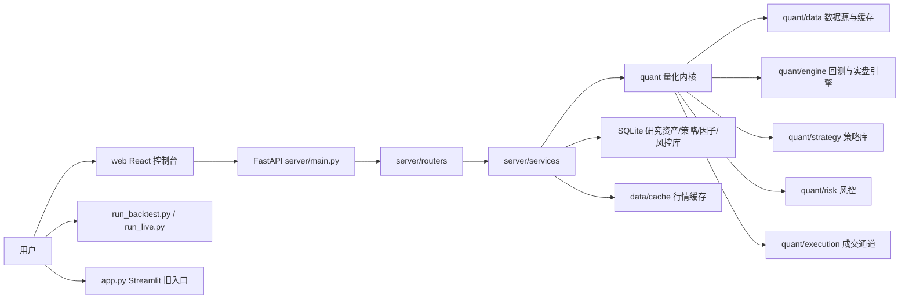

# QuantLab 功能、使用与架构指南

本文档面向两类人：一类是想马上体验系统的使用者，另一类是准备继续开发量化平台的工程同学。它描述的是当前代码库的实际能力，而不是远期设想。

## 1. 当前可用能力

QuantLab 已经从单一回测工具扩展为一套本地可运行的量化研究控制台。主入口是 React 控制台，后端是 FastAPI，底层复用 `quant/` 量化内核。

### 1.1 系统总览

入口：顶部导航 `系统总览`

能力：

- 查看 API 健康状态、版本、数据缓存、策略库、指标库、研究资产、AI 配置、实盘配置和部署检查。
- 给出数据准备度百分比和上线前建议。
- 快速跳转到数据平台、回测研究、智能选股和 AI 研究员。

对应接口：

- `GET /api/health`
- `GET /api/system/status`
- `GET /api/agent/status`
- `GET /api/market/jobs/current`

### 1.2 数据平台

入口：顶部导航 `数据平台`

能力：

- 查看本地行情缓存、股票池、指标目录和最新数据日期。
- 从通达信或 TuShare 拉取行情。
- 支持单独刷新全市场股票池；当本地没有 `symbols.parquet` 时，全市场下载会先尝试从通达信刷新 A 股股票池，避免只下载已有缓存中的少数股票。
- 支持全市场下载、已有缓存增量更新、后台任务进度查看。
- 支持任务暂停、恢复、取消。
- 提供日线、周线、月线和技术指标查询能力。

核心接口：

- `GET /api/market/cache`
- `GET /api/market/cache/status`
- `GET /api/market/stocks`
- `GET /api/market/kline`
- `GET /api/market/indicators`
- `POST /api/market/update`
- `POST /api/market/download-all`
- `GET /api/market/jobs/current`
- `POST /api/market/jobs/{job_id}/pause`
- `POST /api/market/jobs/{job_id}/resume`
- `POST /api/market/jobs/{job_id}/cancel`
- `POST /api/market/v2/update`
- `POST /api/market/v2/resample`
- `POST /api/market/v2/refresh-calendar`
- `POST /api/market/v2/refresh-universe`

### 1.3 策略管理

入口：顶部导航 `策略管理`

能力：

- 管理可复用策略资产，支持新建、编辑、删除和启停。
- 每个策略资产绑定一个基础策略，例如 `ma_cross`、`bbi_kdj_trend`、`dip_buy`。
- 策略参数表单会根据基础策略的参数 schema 自动生成。
- 支持标签和说明，便于把策略沉淀为可复用研究资产。

数据存储：

- SQLite：`data/meta/strategies.sqlite3`

核心接口：

- `GET /api/strategy/list`
- `GET /api/strategy/assets`
- `GET /api/strategy/assets/{asset_id}`
- `POST /api/strategy/assets`
- `PUT /api/strategy/assets/{asset_id}`
- `DELETE /api/strategy/assets/{asset_id}`

### 1.4 回测研究

入口：顶部导航 `回测研究`

能力：

- 配置策略、标的、日期、初始资金、最大仓位和最大回撤。
- 策略下拉读取 `策略管理` 中的组合策略库；策略管理保存、编辑或新增的策略会成为回测可选策略。
- 运行回测，展示绩效指标、K 线、叠加指标、子图指标、权益曲线和成交记录。
- 回测成功后自动写入研究资产库。
- 支持参数网格实验，通过组合参数批量运行回测。

核心接口：

- `GET /api/strategy/list`
- `POST /api/backtest/run`
- `POST /api/backtest/grid`

### 1.5 研究资产库

入口：顶部导航 `研究资产`

能力：

- 管理历史回测实验。
- 查看收益、回撤、交易数、权益曲线和请求参数。
- 收藏实验，维护标签和备注。
- 按收藏或标签过滤实验。
- 选择 2 到 6 条实验进行对比，展示指标对比和归一化权益曲线。
- 导出 Markdown 研究报告。

数据存储：

- SQLite：`data/meta/research.sqlite3`

核心接口：

- `GET /api/research/summary`
- `GET /api/research/backtests`
- `GET /api/research/backtests/{run_id}`
- `PATCH /api/research/backtests/{run_id}/metadata`
- `POST /api/research/reports/backtests.md`

### 1.6 因子研究

入口：顶部导航 `因子研究`

能力：

- 管理内置因子和自定义因子，支持新建、编辑、删除、启停、分类和默认权重。
- 自定义因子保留表达式字段，例如 `close / close.shift(20) - 1`，用于后续接入表达式计算引擎。
- 因子挖掘模块会扫描本地缓存行情，对候选因子计算 Spearman IC、样本数、覆盖率和方向。
- 当前候选因子包括动量、波动率、量比、均线偏离和成交额类基础因子。

数据存储：

- SQLite：`data/meta/factors.sqlite3`

核心接口：

- `GET /api/factors`
- `POST /api/factors`
- `PUT /api/factors/{factor_id}`
- `DELETE /api/factors/{factor_id}`
- `POST /api/factors/mine`

### 1.7 智能选股

入口：顶部导航 `智能选股`

能力：

- 三种模式：策略组合、因子评分、经典信号。
- 策略组合模式支持多条件组、条件权重、必选条件、阈值过滤和保存策略。
- 因子评分模式支持权重调节和过滤条件。
- 经典信号模式复用策略信号进行批量筛选。
- 结果支持表格排序、命中原因展示和 K 线联动查看。

核心接口：

- `POST /api/screening/scan`
- `POST /api/screening/score`
- `GET /api/screening/factors`
- `GET /api/screening/composer/metrics`
- `GET /api/screening/composer/strategies`
- `POST /api/screening/composer/strategies`
- `PUT /api/screening/composer/strategies/{strategy_id}`
- `DELETE /api/screening/composer/strategies/{strategy_id}`
- `POST /api/screening/composer/scan`

### 1.8 风险控制

入口：顶部导航 `风险控制`

能力：

- 独立管理风控规则，支持新建、编辑、删除和启停。
- 规则覆盖最大仓位、最大回撤、单笔订单上限、止损比例、止盈比例和最大持仓标的数。
- 页面提供规则评估样例，用于验证某组持仓、订单和回撤输入是否会被拦截。
- 后续实盘或模拟交易模块可以直接复用该规则存储与评估服务。

数据存储：

- SQLite：`data/meta/risk.sqlite3`

核心接口：

- `GET /api/risk/rules`
- `POST /api/risk/rules`
- `PUT /api/risk/rules/{rule_id}`
- `DELETE /api/risk/rules/{rule_id}`
- `POST /api/risk/evaluate`

### 1.9 AI 研究员

入口：顶部导航 `AI 研究员`

能力：

- 提供面向量化研究的对话入口。
- 在依赖和 API Key 可用时，后端会挂载 `/api/agent` 路由。
- 当前页面会显示 Agent 运行状态；没有配置模型 Key 时，不影响回测、数据、选股和研究资产功能。

配置项：

- `DEEPSEEK_API_KEY`
- `ANTHROPIC_API_KEY`
- 其他模型和端点配置见 `config/quant.env.example`

核心接口：

- `GET /api/agent/status`
- `WebSocket /api/agent/chat`
- `POST /api/agent/chat`
- `GET /api/agent/sessions`
- `DELETE /api/agent/sessions/{session_id}`

### 1.10 交易运行中心

入口：顶部导航 `交易运行`

能力：

- 只读展示实盘配置、策略参数、标的列表、风控参数、券商通道和调度计划。
- 给出实盘启动命令和仿真/回测验证命令。
- 展示人工确认清单。

安全边界：

- Web UI 不连接券商。
- Web UI 不解锁账户。
- Web UI 不自动下单。
- 实盘必须通过人工运行 `python run_live.py configs/live_ma_cross.yaml` 启动。

核心接口：

- `GET /api/trading/status`

## 2. 快速体验

### 2.1 Windows 推荐流程

首次 clone 后：

```powershell
cp config\quant.env.example config\quant.env
python -m venv .venv
.\.venv\Scripts\python.exe -m pip install --prefer-binary -r requirements.txt
cd web
npm ci
cd ..
.\.venv\Scripts\python.exe scripts\verify_clone_start.py
```

启动：

```powershell
.\quant.ps1 start
```

或者双击：

```text
start-windows.cmd
```

访问：

- 控制台：`http://127.0.0.1:5174`
- API 文档：`http://127.0.0.1:8001/docs`
- 健康检查：`http://127.0.0.1:8001/api/health`

停止：

```powershell
.\quant.ps1 stop
```

### 2.2 macOS / Linux

```bash
cp config/quant.env.example config/quant.env
python -m venv .venv
. .venv/bin/activate
pip install --prefer-binary -r requirements.txt
cd web && npm ci && cd ..
./quant.sh start
```

停止：

```bash
./quant.sh stop
```

### 2.3 容器化体验

先确认配置文件：

```bash
cp config/quant.prod.env.example config/quant.prod.env
python scripts/verify_deployment_config.py
```

启动：

```bash
docker compose up --build -d
```

访问：

- 控制台：`http://127.0.0.1:8080`
- 健康检查：`http://127.0.0.1:8080/api/health`

更多部署说明见 `docs/DEPLOYMENT.md`。

## 3. 推荐体验路线

1. 打开 `系统总览`，确认 API 状态、数据准备度和上线检查。
2. 进入 `数据平台`，查看本地缓存。如果是全新环境，先刷新股票池，再下载常用标的或全市场数据。
3. 进入 `策略管理`，查看内置策略资产，新建一个带标签和自定义参数的策略。
4. 进入 `回测研究`，使用默认 MA 均线策略和 `600519` 运行一次回测。
5. 进入 `研究资产`，打开刚才保存的实验，添加标签、备注或收藏。
6. 在 `研究资产` 中选择多条实验生成对比，导出 Markdown 报告。
7. 进入 `因子研究`，新增一个自定义因子，并运行一次因子挖掘。
8. 进入 `智能选股`，尝试策略组合模式或因子评分模式。
9. 进入 `风险控制`，新建一条风控规则并运行样例评估。
10. 进入 `交易运行`，查看实盘安全边界和人工启动命令。
11. 如果已经配置模型 Key，再体验 `AI 研究员`。

## 4. 架构总览



### 4.1 前端

目录：`web/`

技术栈：

- React 19
- Vite 8
- Ant Design 6
- ECharts
- Zustand

重要模块：

- `src/App.tsx`：主应用入口，页面级懒加载。
- `src/components/layout/`：顶部导航、侧边栏、工作区布局。
- `src/pages/DashboardPage.tsx`：系统总览。
- `src/pages/DataPage.tsx`：数据平台。
- `src/pages/StrategyPage.tsx`：策略管理。
- `src/pages/BacktestPage.tsx`：回测研究。
- `src/pages/ResearchPage.tsx`：研究资产库。
- `src/pages/FactorPage.tsx`：因子研究。
- `src/pages/ScreeningPage.tsx`：智能选股。
- `src/pages/RiskPage.tsx`：风险控制。
- `src/pages/TradingPage.tsx`：交易运行中心。
- `src/pages/AgentPage.tsx`：AI 研究员。
- `src/api/client.ts`：REST API 客户端。
- `src/api/agent.ts`：Agent WebSocket 和会话 API。

性能设计：

- 大页面通过 `React.lazy` 按需加载。
- Vite/Rolldown 将 React、AntD、ECharts、Markdown 和通用 vendor 拆包。
- 当前生产构建最大 JS chunk 约 190KB，入口约 26KB。

### 4.2 后端

目录：`server/`

技术栈：

- FastAPI
- Pydantic
- SQLite
- WebSocket

路由层：

- `server/routers/backtest.py`
- `server/routers/market.py`
- `server/routers/screening.py`
- `server/routers/research.py`
- `server/routers/system.py`
- `server/routers/trading.py`
- `server/routers/strategy.py`
- `server/routers/strategy_assets.py`
- `server/routers/factors.py`
- `server/routers/risk.py`
- `server/agent/router.py`

服务层：

- `server/services/backtest_service.py`：回测与参数网格。
- `server/services/market_service.py`：K 线、指标、缓存和股票池查询。
- `server/services/data_job_service.py`：后台数据任务。
- `server/services/screening_service.py`：经典信号和因子评分。
- `server/services/factor_strategy_service.py`：组合选股策略。
- `server/services/strategy_asset_service.py`：可管理策略资产。
- `server/services/factor_service.py`：因子库与基础 IC 挖掘。
- `server/services/risk_service.py`：独立风控规则与评估。
- `server/services/research_service.py`：研究资产持久化、元数据和报告。
- `server/services/system_service.py`：上线就绪检查。
- `server/services/trading_service.py`：实盘配置只读检查。

### 4.3 量化内核

目录：`quant/`

核心职责：

- `quant/core/`：Bar、Signal、Order、Fill、Position、Portfolio 等领域对象。
- `quant/data/`：AkShare、TuShare、TDX、CSV 数据源，本地缓存和指标计算。
- `quant/engine/`：回测引擎和实盘引擎。
- `quant/execution/`：模拟经纪商和 Futu 经纪商适配。
- `quant/risk/`：仓位、回撤和交易约束。
- `quant/strategy/`：策略基类和示例策略。

### 4.4 数据与状态

常用路径：

- `config/quant.env`：本地运行配置，通常不提交。
- `config/quant.env.example`：本地配置模板。
- `config/quant.prod.env.example`：容器化部署配置模板。
- `configs/*.yaml`：回测和实盘任务配置。
- `data/cache/`：行情缓存。
- `data/meta/research.sqlite3`：研究资产库。
- `data/meta/strategies.sqlite3`：策略资产库。
- `data/meta/factors.sqlite3`：因子资产库。
- `data/meta/risk.sqlite3`：风控规则库。
- `data/meta/symbols.parquet`：全市场股票池。
- `.logs/`：启动脚本和烟测日志。
- `.pids/`：本地启动脚本进程记录。

## 5. 测试与验收

当前推荐验收命令：

```powershell
.\.venv\Scripts\python.exe -m pytest -q
cd web
npm run lint
npm run build
cd ..
.\.venv\Scripts\python.exe scripts\verify_clone_start.py
.\.venv\Scripts\python.exe scripts\verify_deployment_config.py
```

`scripts/verify_clone_start.py` 会串联：

- 后端 import 检查。
- API 健康检查。
- 后端测试。
- 前端生产构建。

当前已验证结果：

- 后端测试：`61 passed`。
- 前端 lint：通过。
- 前端生产构建：通过，无 500KB chunk 警告。
- clone 启动验收：通过。
- 部署配置检查：通过。
- 浏览器主页面烟测：系统总览、数据平台、交易运行、研究资产、回测研究、智能选股、AI 研究员均可打开，控制台无 error。

已知提示：

- 测试中可能出现 Starlette TestClient 关于 `httpx` 的 deprecation warning，不影响当前功能。
- `verify_deployment_config.py` 在本机没有 Docker Compose 时会返回 `docker_compose_validated: false`，这表示未执行 compose 解析，不等于配置失败。

## 6. 上线边界与注意事项

1. 当前系统适合作为本地或内网量化研究平台体验和继续开发。
2. 实盘交易入口保持人工启动，Web 端只展示状态和命令。
3. 全市场数据下载依赖外部数据源，速度和稳定性受网络、源站和 Token 配置影响。
4. AI 研究员依赖模型 API Key；未配置时不会影响其他模块。
5. 研究资产库使用本地 SQLite，适合单机使用；多人协作或生产级多实例部署时建议迁移到独立数据库。
6. 若要公开部署，需要补充认证、权限、审计、HTTPS、密钥管理和更严格的实盘权限隔离。

## 7. 下一步建议

优先级较高：

- 为数据任务增加更完整的失败重试和任务历史查询。
- 为研究资产增加删除、归档和批量标签管理。
- 将用户配置、研究资产和任务记录迁移到可选 PostgreSQL。
- 增加 Playwright 自动化 UI 测试，覆盖主导航和关键操作。
- 为实盘运行中心增加只读运行日志面板，但继续禁止 Web 下单。

优先级中等：

- 增加更多策略模板和因子库。
- 增加组合层面的资金曲线、风险归因和行业暴露。
- 增加报告模板，支持 PDF 或 HTML 研究报告导出。
- 增加数据质量报告，例如缺失交易日、异常涨跌幅、重复 K 线检查。
